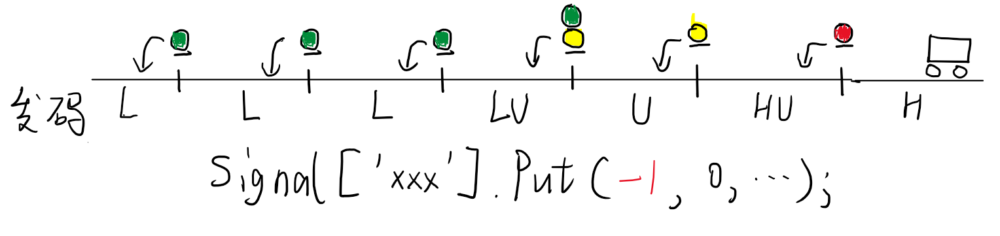

# CTCS0-Ats
CTCS-0列控系统插件，适用于BVE Trainsim 5/6

## 线路端配置流程

### Section配置
CTCS-0的机车信号系统类似日本WS-ATC，以地面信号为主体。但是由于其预告次一架信号机的显示状态，而不是复示已通过的信号机显示状态，且电码化逻辑比较复杂，故不能和往常配置ATS线路一样设置闭塞分区，而是参照ATC的方式。

**Section.Begin()语句表示的是当前轨道电路区段的发码情况，一切Index都表示轨道电路的电码。**

| Index | 机车信号码 | 信号含义 |
| ----- | --- | --------- |
| 0 | HU | 红灯 |
| 2 | U | 黄灯 |
| 3 | LU | 绿黄灯 |
| 4 | L | 绿灯 |
| 5 | L2 | |
| 6 | L3 | |
| 7 | L4 | |
| 8 | L5 | |
| 9 | H | 绝对停止信号 |
| 10 | HB | 引导信号或容许信号 |
| 11 | UU | 双黄灯 |
| 12 | UUS | 黄闪黄 |
| 13 | U2 | 前方为双黄灯 |
| 14 | U2S | 前方为黄闪黄 |
| 其他 | B | 无码 |

### 信号机配置
我在FCS_TM的信号机模型基础上修改，制作出了一部分CTCS信号机模型。出于版权原因，这里尚不公开提供，有需要的请私下联系我。

Signal需要按照下面的方式布置：

